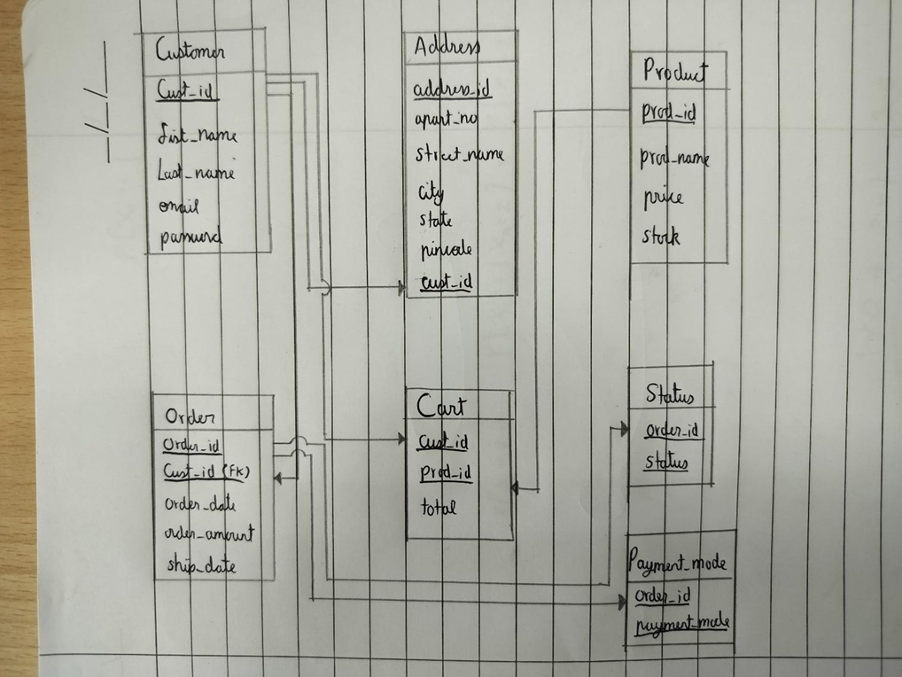
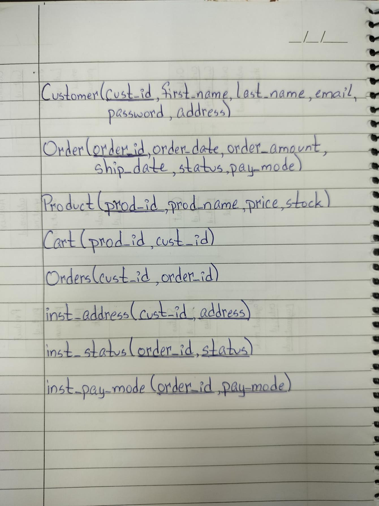
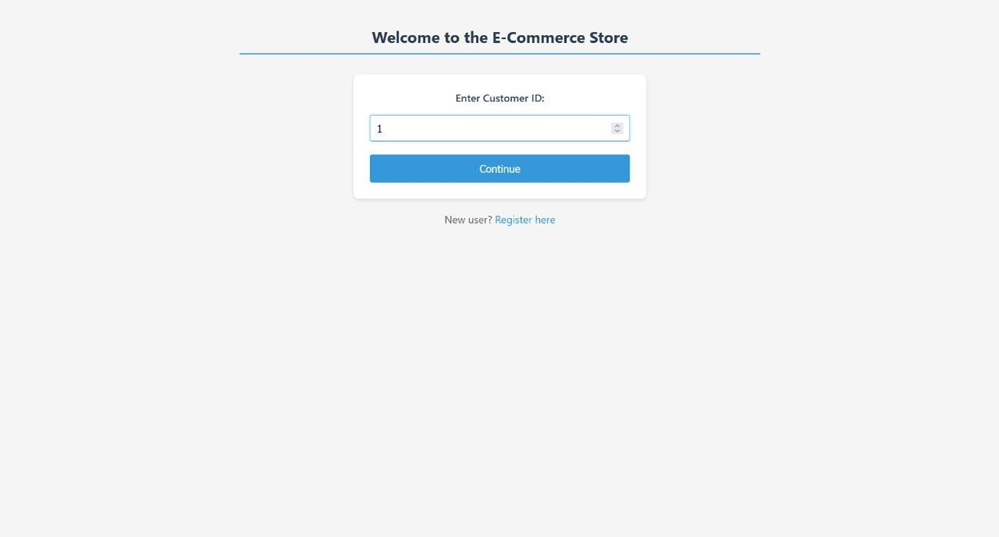
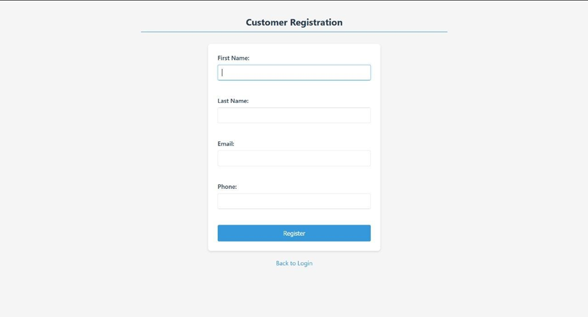
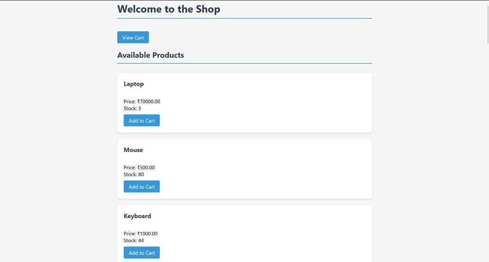
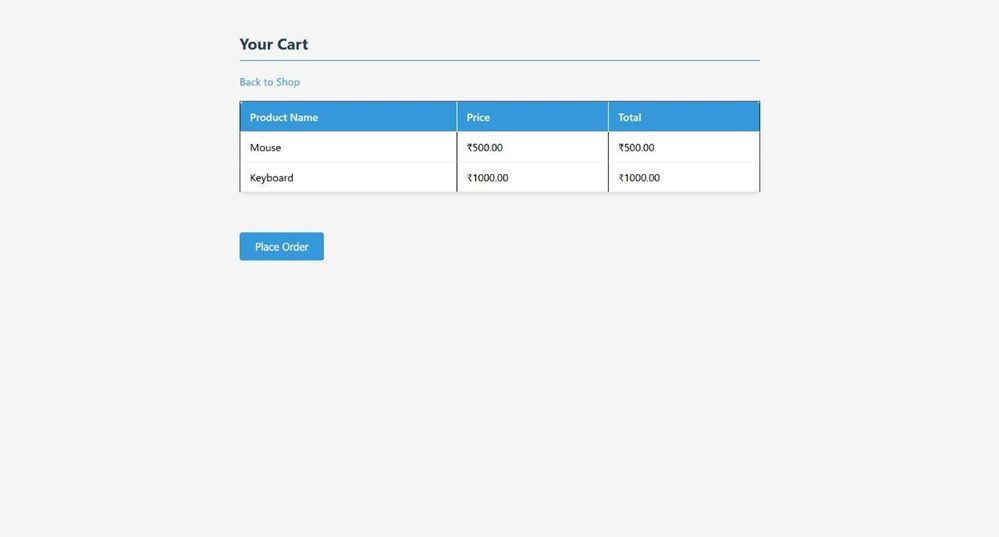
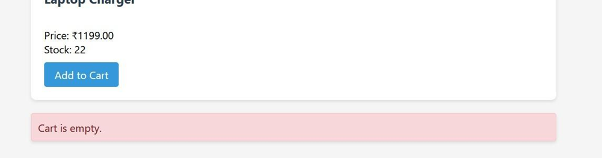
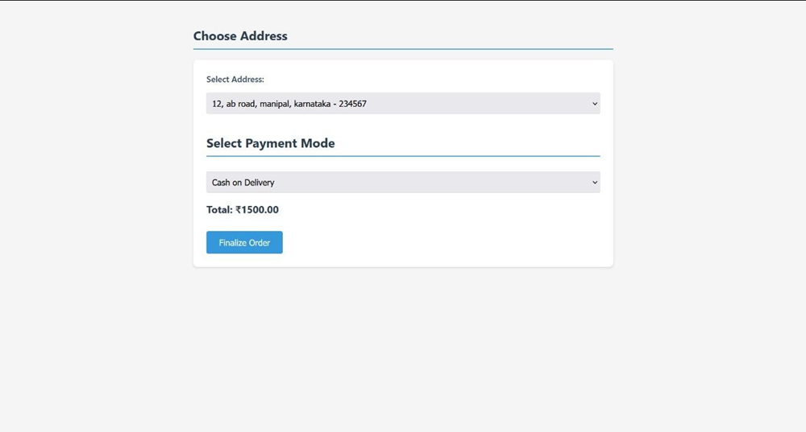
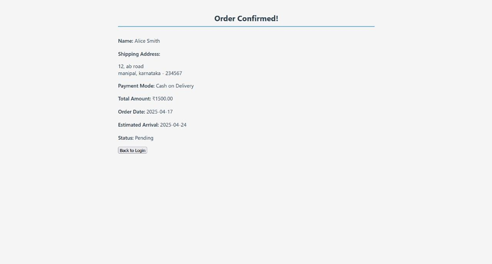

# Functional E-Commerce Website

This is a fully functional e-commerce website project implemented using Flask and MySQL. It demonstrates key features required for an online shopping platform, including user registration and login, product catalog, shopping cart, address management, and order placement.

## Features

- User registration and authentication  
- Browse products with details  
- Add/remove items to/from shopping cart  
- Select or add new delivery address during checkout  
- Place orders and view order summary  
- Backend implemented with Flask, database handled by MySQL

## Technologies Used

- Python 3.x  
- Flask  
- MySQL  
- HTML/CSS (for frontend templates)  

### Prerequisites

- Python 3.x installed  
- MySQL server running and accessible  
- Required Python packages (Flask, MySQL connector, etc.)

## Schema Diagram

## Relational Schema

## Results

## Future Improvements

- Add payment gateway integration  
- Enhance frontend with modern JavaScript frameworks  
- Add admin panel for product management  
- Implement product search and filtering  

## Author

Akshit Sachdeva  
B.Tech Data Science, Manipal Institute of Technology

---

Feel free to explore the code and reach out if you want to collaborate or have questions!
